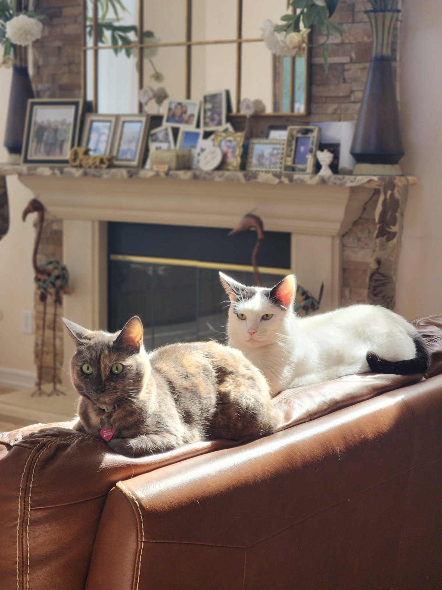

# Lawrence Novilla
Hello, my name is **Lawrence** and this is my introductory page for CSE 110.

## Cats

> I love cats.

``` python
print("Hello World")
```
  
## My Favorite Foods

1. Tacos
2. Lasagna
3. Shrimp

## Places I Want To Travel To

- [x] Taiwan
- [x] China
- [ ] Dubai

## Programming Languages I Am Familiar With

- Python
- Java
- C
- C++
- Assembly

Here is an example of python

## Links About Me
[My Github](https://github.com/lnovilla8)

---

[Go Back to the Top](#lawrence-novilla)
[HELLO](other.md)
